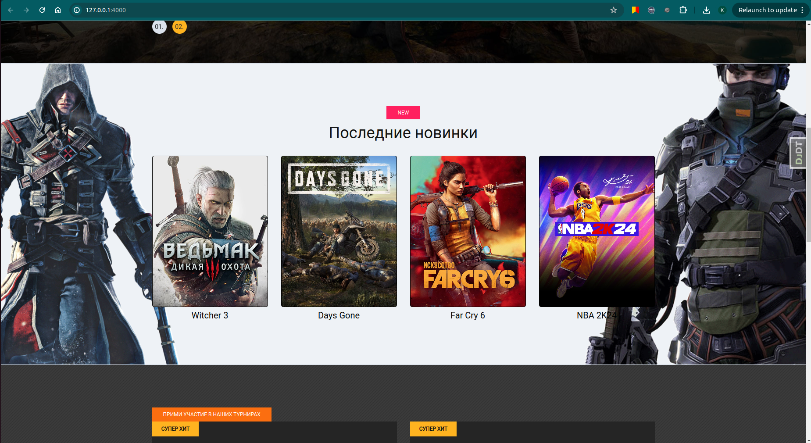
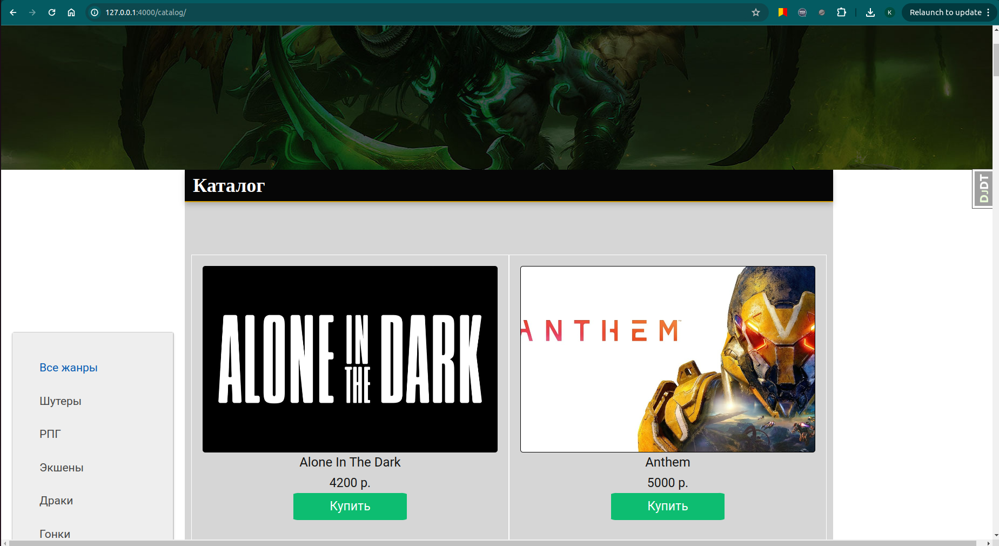
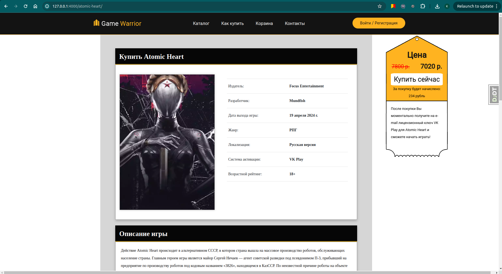

# Game-Store

Данный проект посвящен созданию интернет-магазина компьютерных игр. Проект находится в стадии разработки, реализуется с помощью фрейморка Django 5.0.

На данный момент реализованы:

- главная страница

- каталог игр

- страница с данными о конкретной игре

В каталоге возможна фильтрация игр по жанрам
